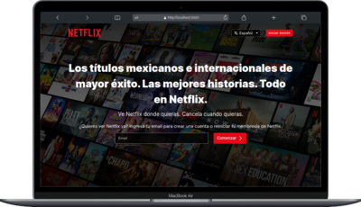

# Netflix Clone

This project is a Netflix Clone built for educational purposes.

## Table of contents

- [Getting Started](#getting-started)
  - [Setup](#setup)
  - [Configuring Environment Variables](#configuring-environment-variables)
  - [Configuring Prisma](#configuring-prisma)
  - [Development](#development)
  - [Linting](#linting)
  - [Building Preview](#building-preview)
- [Technologies](#technologies)
- [Demo](#demo)

## Getting Started

### Setup

```sh
# Clone Project
git clone https://github.com/your-username/netflix-clone.git

# Install Dependencies
cd netflix-clone
npm install
```

### Configuring environment variables

Create a .env file in the project root and add the following variables:

- NEXTAUTH_SECRET: Secret used for authentication
- NEXTAUTH_URL: Current project URL
- DATABASE_URL: Database URL used by prisma
- DIRECT_URL: Direct database URL used by prisma to make migrations
- TMDB_API_KEY: Your "The Movie Data Base" API key

```sh
# Create the file
touch .env
```

### Development

To start the development server, run:

```sh
npm run dev
```

Open http://localhost:3000 to view the project.

### Linting

Ensure your code adheres to the project's coding standards by running:

```sh
npm run lint
```

### Building Preview

To build the project for production, use:

```sh
npm run build
```

To start a server with the production build, run:

```sh
npm run start
```

## Technologies

- Nextjs
- Prisma
- NextAuth.js
- Tailwindcss
- Formik
- Yup
- Shadcn

## Demo


